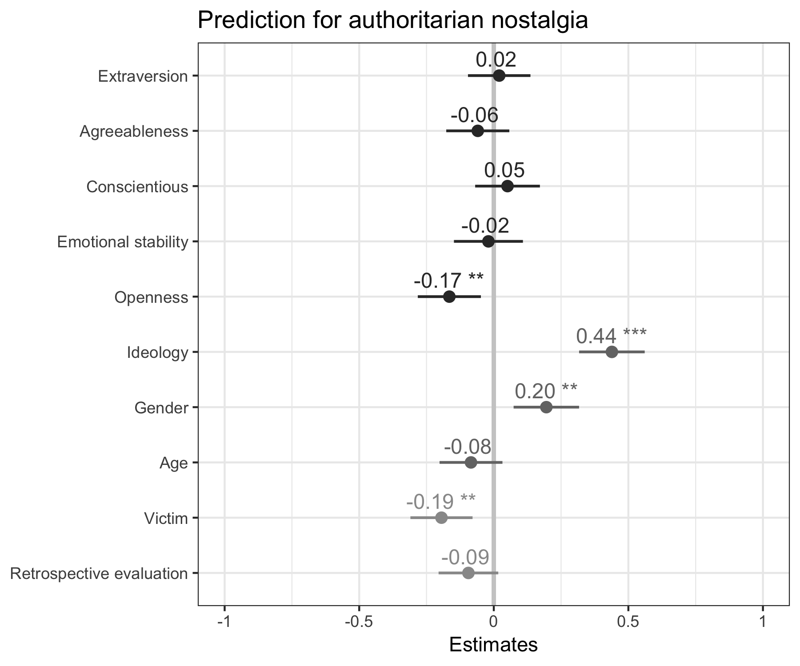

+++
# A Recent Publications section created with the Pages widget.
# This section displays recent blog posts from `content/publication/`.

widget = "pages"  # See https://sourcethemes.com/academic/docs/page-builder/
headless = true  # This file represents a page section.
active = true  # Activate this widget? true/false
weight = 30  # Order that this section will appear.

title = "Dissertation Project"
subtitle = ""

[content]
  # Page type to display. E.g. post, talk, or publication.
  page_type = "dissertation"
  
  # Choose how much pages you would like to display (0 = all pages)
  count = 5
  
  # Choose how many pages you would like to offset by
  offset = 0

  # Page order. Descending (desc) or ascending (asc) date.
  order = "desc"

  # Filter posts by a taxonomy term.
  [content.filters]
    tag = ""
    category = ""
    publication_type = ""
    author = ""
    exclude_featured = false
  
[design]
  # Toggle between the various page layout types.
  #   1 = List
  #   2 = Compact
  #   3 = Card
  #   4 = Citation (publication only)
  view = 2
  
[design.background]
  # Apply a background color, gradient, or image.
  #   Uncomment (by removing `#`) an option to apply it.
  #   Choose a light or dark text color by setting `text_color_light`.
  #   Any HTML color name or Hex value is valid.
    
  # Background color.
  # color = "navy"
  
  # Background gradient.
  # gradient_start = "DeepSkyBlue"
  # gradient_end = "SkyBlue"
  
  # Background image.
  # image = "background.jpg"  # Name of image in `static/img/`.
  # image_darken = 0.6  # Darken the image? Range 0-1 where 0 is transparent and 1 is opaque.

  # Text color (true=light or false=dark).
  # text_color_light = true  
  
[advanced]
 # Custom CSS. 
 # css_style = ""
 
 # CSS class.
 # css_class = ""
+++

 Voting for nostalgia?: Authoritarian legacies and voting behavior in post-authoritarian democracies. 

Why do voters popularly elect parties associated with former dictatorships? Democratic rule has been the modal political system since the Third Wave of democratization, but the legacies of authoritarian rule still drive political behavior in many new democracies. Politicians often win elections by evoking the achievements of a former autocrat or by recycling the political rhetoric of the old regime. In my dissertation, I claim that voters' social identities originating from authoritarian nostalgia form the basis of this electoral support. Defining authoritarian nostalgia as a positive affective attachment to the achievements from the former period of dictatorship, this project examines personality traits that drive these attachments as the foundation of this political behavior and predicts how each factor contributes to an individual propensity for authoritarian nostalgia. Longing for the authoritarian past can function as a remedy for a lack of satisfaction with the new democratic regime and help construct a social identity that embraces core values from the authoritarian period. This dissertation project seeks to establish a yet unexamined concept and explain political attitudes, asymmetric political bias, and voting behavior in post-authoritarian democracies.
